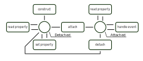

# Component lifecycle

The diagram below shows states of component and operations that can be performed on/by the component.

## Component states

The two main states of a component are "detached" state and "attached" state.
In "attached" state the component is attached to a [LogicNode](./Nodes.md) and thus is accessible by other components through the node tree.
Attached component may handle events (PSB does not provide any limitations on what events may the component handle and does not provide any built-in events; component may subscribe to whatever it needs to subscribe to).
Attached component is allowed to hold some disposable resources.

Detached component cannot handle any events and is not allowed to hold any disposable resources (instead it should hold information of how to get those resources when necessary).
PSB may change properties of detached component.
Detached component may be used as a template for creation of other components (clones); in this case it probably will never be attached to any node.
PSB may lose reference to detached component and let GC to collect it at any moment of time (that's why there should be no disposable resources held by detached component).

## Component operations

### Construct

Just a constructor invocation.

### Set property

Property setup from deserialized declarative description or in process of "cloning" operation.

### Attach

The operation of attachment of a component to a `LogicNode`.
On components implementing `NodeAttachmentListener` interface `onAttach(node)` method is called  with the node the component is attached to as first argument.

At this moment the component should acquire all necessary resources and subscribe to all necessary events.

### Handle event

Handling of an event the component is subscribed to.

In most cases event handling means reaction to message received from `Topic` instance.

As it was told before PSB does not limit set of events a component may subscribe to and does not provide any built-in events.

### Read property

Property read operation performed for any purpose including application state serialization, component cloning and debugging.
Property read operation may be performed at any moment (except that it cannot be performed concurrently with other operations) so component should keep property values consistent at any moment of time between other operations.

### Detach

The operation of detachment of the component from a `LogicNode`.
On components implementing `NodeAttachmentListener` interface `onDetach(node)` method is called  with the node the component was attached to as first argument.

At this moment component should release all acquired disposable resources and unsubscribe from all events it was subscribed to.
